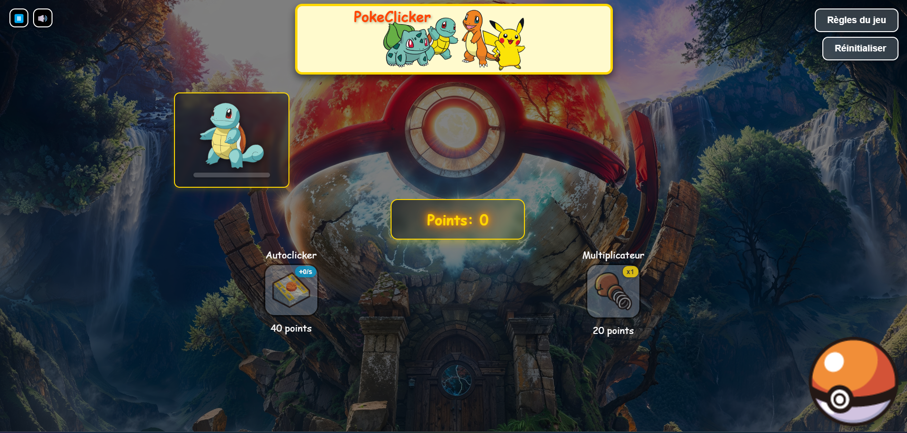

# __PockeClicker__

Ce projet est un exercice d'école consitant à créer un jeu de Cookie Clicker avec un certain thème au choix.

## Projet réalisé par :
----------------------------

- AIT ABDELKARIM Abdellah

## Langages utilisés 
----------------------------

  - HTML 
  - CSS
  - JavaScript

## Le contenu
----------------------------

PokeClicker est un jeu de clic inspiré de l'univers Pokémon. Le but est de cliquer pour accumuler des points et faire évoluer vos Pokémon, tout en achetant des améliorations pour accélérer votre progression. Des Pokémon légendaires apparaissent également de manière aléatoire pour offrir des bonus de points !

## Fonctionnalités
----------------------------

- Cliquez sur la Pokéball pour gagner des points et progresser dans le jeu.
- Accumulez des points pour faire évoluer vos Pokémon à travers plusieurs étapes.
- Barre de progression : Suivez l'avancement de chaque Pokémon vers sa prochaine évolution.
- Des Pokémon légendaires apparaissent toutes les 45 secondes pour une durée de 3 secondes. Cliquez dessus pour gagner des points bonus avant qu'ils disparaissent.
- Notifications : Chaque événement important, déclenche une notification visuelle.
- Effets visuels : Des animations fluides sont intégrées pour chaque évolution, clic et notification, rendant le jeu agréable.
- Sons de clic : Un son de clic est associé aux interactions pour un retour audio à chaque clic.
- Curseur personnalisé : Un curseur thématique est ajouté pour correspondre au style du jeu.
- Les images et éléments de jeu ne sont pas déplaçables, et le texte n'est pas sélectionnable pour une expérience de jeu optimisée.
- Autoclicker : Cette amélioration génère des points automatiquement pendant 15 secondes. Vous pouvez acheter plusieurs autoclickers pour augmenter les points générés.
- Multiplicateur de points : Ce bonus augmente les points gagnés par clic à chaque achat, rendant chaque clic plus puissant.
- La Pokéball change d'apparence au fil de votre progression.
- Cliquez sur les deux buttons en haut à gauche pour activer ou désactiver le son.

## Instructions de Jeu
----------------------------

- Démarrer le jeu en cliquant sur la Pokéball pour gagner des points.
- Utiliser les points pour acheter des améliorations, comme l'autoclicker et le multiplicateur.
- Faire évoluer les Pokémon en accumulant des points. Chaque évolution est marquée par l'augmentation de la barre de progression.
- Capturer les Pokémon légendaires en cliquant rapidement lorsqu'ils apparaissent pour gagner des points bonus.
- Atteindre l'évolution maximale pour chaque Pokémon avant de passer au Pokémon suivant.

## Améliorations Disponibles
----------------------------

- Autoclicker : Ajoute un clic automatique par seconde pendant 15 secondes. Peut être amélioré pour plus de points automatiques.
- Multiplicateur : Augmente les points gagnés par clic, offrant des bonus de puissance à chaque achat.

## Aperçu
----------------------------

## Installation
----------------------------

Cloner le dépôt en local à l'aide de la commande git clone.

Ouvrir le fichier index.html avec votre navigateur. 

Amusez-vous à cliquer, évoluer, et capturer les Pokémon légendaires.

